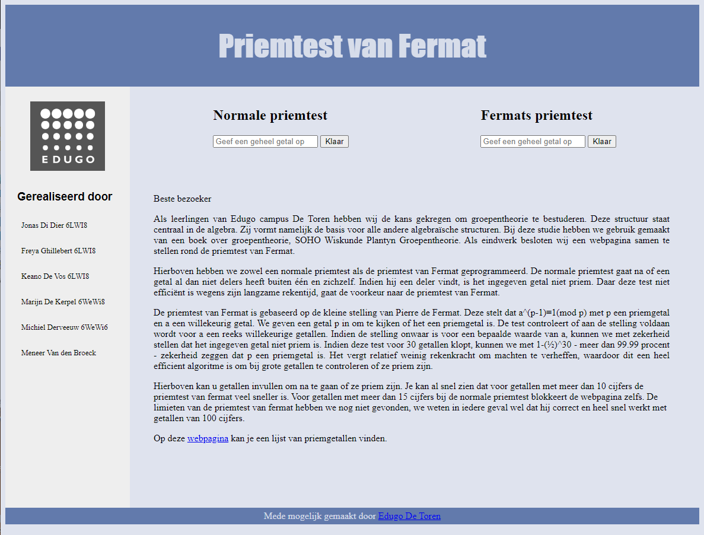

# Priemtest-van-Fermat
A quick HTML website to test if a given number is prime with more than 99% certainty. It's an implementation of the "Fermat primality test" written in javascript and displayed with jQuery.

Written in high-school for an "optional" math seminar, to explore a practical application of discrete mathematics.

